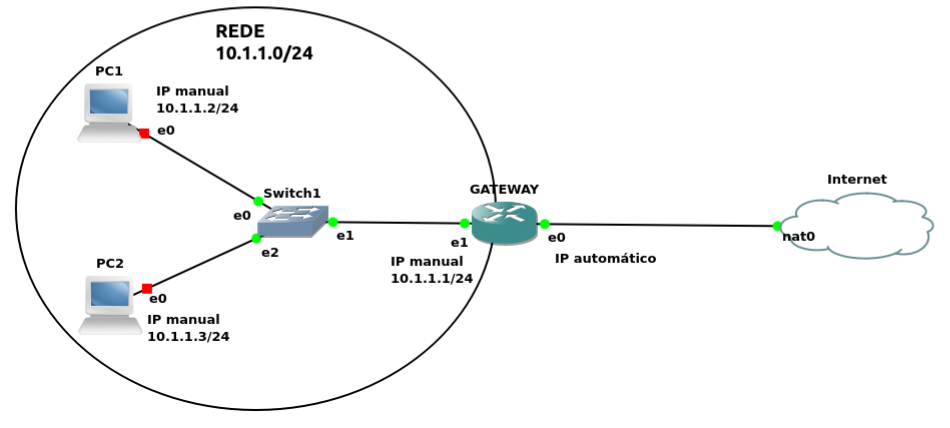

# Gateway


## 1. Objetivo

- Entender os conceitos relacionados a um **Gateway**  
- Reforçar os conhecimentos de Linux, incluindo manipulação de arquivos e diretórios, arquivos de configuração, editores e comandos  
- Utilizar um Linux Ubuntu Server para criar um gateway  

### 2. Conceitos envolvidos
* IP público e privado  
* Gateway  
* Encaminhamento de pacotes  
* Network Address Translation (NAT)  
* Shell Script  
* IP estático e dinâmico  

---


## 3. Diagrama do Experimento




---
## 4. Configurar placas de rede

* Uma máquina gateway (gw), precisa ter duas placas de rede (reais ou virtuais), uma fica ligada na rede interna e outra fica ligada na saída para a internet.
* A placa 0 será a saída e fica com ip automático (dhcp).
* A placa 1 será a ligação com a rede interna e ficará com ip estático.
* É preciso modificar o arquivo de configuração das interfaces de rede.
* Seguem os comandos e um exemplo de arquivo de configuração.

---

## 5. Configuração de rede

Para configurar a rede, é necessário editar o arquivo de configuração. No Ubuntu, esse arquivo geralmente está localizado em:
`/etc/netplan/00-installer-config.yaml ou /etc/netplan/01-netcfg.yaml`

O editor de texto que utilizaremos será o `nano` (nano).

Como se trata de um arquivo de configuração do sistema, é preciso ter permissões de superusuário. Para isso, você pode:

Logar diretamente como usuário `root`, ou

Utilizar o comando `sudo` antes das instruções no terminal.

### Editando o arquivo de configuração de rede

Antes de editar o arquivo de configuração de rede é necessário saber o nome das interfaces disponíveis na máquina.   
Isso pode ser feito com o comando `networkclt`, que em sua saída, mostrará o nome das interfaces.
Comando:
```
networkcl

```
Saída   

  


Neste caso a interface `ens3 é a primeira e ens4 é segunda inteface física`    

Editando o arquivo de configuração de rede.   
O comando `ls /etc/netplan` deve ser utilizado para verificar qual o nome correto do arquivo antes de tentar editar.  

Comando:   
```
nano /etc/netplan/00-installer-config.yaml
ou
nano /etc/netplan/01-netcfg.yaml
```

_**Obs.:** Arquivos com extensão `.yaml` NÃO suportam tabulação.   
Portanto, não utilize a tecla `TAB` ao editar esses arquivos;    
use apenas espaços para indentar corretamente._   


No arquivo, deve ser adicionada a placa de rede adicional e as configurações que dizem respeito a ela, neste caso a primeira placa fica com DHCP ativo, e irá obter endereço IP automaticamente e a segunda placa fica com DHCP desativado e o endereço IP deve ser configurado manualmente.


```
ctrl+o --> salvar
Enter
ctrl+x --> sair do arquivo
```

Após a edição do arquivo é necessário aplicar as novas configurações.   
Comando:   

```
netplan --debug apply
```

Caso exista algum problema de sintaxe no arquivo a configuração não será aplicada, e uma mensagem de erro pode ser apresentada.   

Se tudo der certo, com o comando `ifconfig` será possível vizualizar as interfaces e seus respectivos endereços IP.

Comando:

```
ifconfig
```

Saída:


Agora que o **Gatway** já tem endereço IP, deve se configurar as demais máquinas, manualmente com endereços que pertençam a mesma rede.   
Após configurar as outras máquinas, deve se fazer o teste de conexão entre todas para certificar que a rede foi corretamente configurada, e que todas as máquinas tem acesso ao **Gateway**.

O comando `ping` pode ser utilizado de uma máquina para outra, para realizar o teste de conexão.  

**Exemplo:** ping disparado da máquina Windows para o endereço do **Gateway**.


---

## 6. Encaminhamento de pacotes

Para que uma máquina configurada como gateway permita o tráfego de dados entre diferentes redes, é necessário habilitar o encaminhamento de pacotes.   
Dessa forma, os pacotes recebidos por suas interfaces de rede poderão ser redirecionados para outras máquinas, funcionando como ponto de passagem no fluxo de comunicação.   

Para ativar essa configuração, é necessário editar o arquivo `/etc/sysctl.conf`.   

Comando:   
```
nano /etc/sysctl.conf
```

Procurar pela linha:

```
# net.ipv4.ip_forward=1
```

E remover o símbolo de comentário `# ` do início da linha.

Resultado:

```
net.ipv4.ip_forward=1
```

Salvar o arquivo, sair e reiniciar a máquina

```
ctrl+o --> salvar
Enter
ctrl+x --> sair do arquivo
reboot
```

---

## 7. Regras do IPTABLES e NAT

Para que a comunicação entre as máquinas da rede interna e da rede externa ocorra de forma eficiente, é necessário configurar corretamente as regras de firewall do iptables e também as regras de NAT.   
Essas configurações garantem tanto a segurança quanto o encaminhamento adequado dos pacotes entre as redes.


### Comandos básicos de listagem e limpeza do IPTABLES

| Comando                   | Função                                                       |
| ------------------------- | ------------------------------------------------------------ |
| `sudo iptables -L`        | Lista as regras de firewall do iptables                      |
| `sudo iptables -L -t nat` | Lista as regras de NAT do iptables                           |
| `sudo iptables -F -t nat` | Desativa o NAT                                               |
| `sudo iptables -F`        | Limpa as regras de firewall, permitindo que todos os pacotes trafeguem |


### Regra para ativar o NAT no IPTABLES

Para que a navegação funcione devidamente entre a rede interna e a rede externa, o NAT deverá ser ativado na interface de saída do **Gateway**.

Comando:

```
iptables -t nat -A POSTROUTING -o nome_placa_0 -j MASQUERADE 
```

Onde "nome_placa_0", deve ser substituido pelo nome da interface de saída do **Gateway**.


Após aplicar a regra, é possível verificar se ela entrou na lista do IPTABLES com o comando demonstrado na tabela anterior.

Saída:


---

## 8. Testes de conexão

Após realizar as configurações anteriores é possível testar a conexão com redes externas como a Internet.  
Os testes nas máquinas internas/clientes podem ser realizados tentando navegar normalmente pelo navegador ou com o comando `ping` por exemplo disparando para um site conhecido.

### Teste de conexão externa com ping

Teste com ping no Windows disparando para um site.   
Saída:   


Teste com ping no Linux disparando para um site.   
Saída:   


### Teste de conexão externa com navegação

O teste de navegação pode ser realizado com qualquer navegador em qualquer site.  
Saída:   


---


## 9 Automatizando o NAT

O IPTABLES responsável por implementar o NAT no sistema, tem o comportamento padrão de **não** salvar o estado atual, após uma reinicialização do sistema, ou seja, em seu funcionamento normal, se o sistema for reiniciado, todas as regras são apagadas.  
Existem diferentes formas de resolver ou contornar esse comportamento, como salvar as regras e reaplicar por exemplo.   

Neste experimento para fins de aprendizagem será utilizada a abordagem de criar um _script_ para que a regra de NAT possa ser reaplicada quando o sistema reiniciar.   

_Obs.: Posteriormente em aulas específicas de IPTABLES será demonstrado como salvar as regras para que sejam reaplicadas automaticamente_

### Criando o _script_

O arquivo tipo _script_ poderia ser criado em qualquer ponto (diretório) do sistema, mas, por questão de organização, ele será criado na pasta `/usr/local/bin`.

Criando o arquivo:   
```
nano /usr/local/bin/nat.sh
```

O _script_ deve conter uma funcionalidade de _start_ para adicionar a regra de NAT ao IPTABLES, uma funcionalidade de _stop_ para remover a regra e uma de funcionalidade de _restart_.   

Após criar o arquivo é necessário acertar as permissões para ele se torne executável.   

Comando:   
```
chmod 740 /usr/local/bin/nat.sh
```

Executando o _script_:
```
bash /usr/local/bin/nat.sh start
ou
bash /usr/local/bin/nat.sh stop
ou
bash /usr/local/bin/nat.sh restart
```
Testes:   
Para testar, novamente basta listar as regras do IPTABLES e verificar se foram aplicadas ou apagadas como deveriam de acordo com a opção usada no _script_.  
Testes de navegação nas máquinas clientes também devem ser realizados.

Exemplo do _script_ pronto:   


