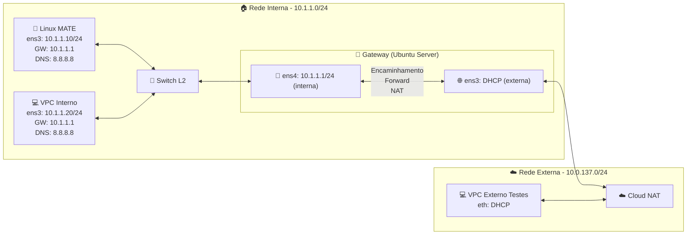

# Experimento DHCP

## Objetivo

Configurar e aplicar regras de firewall com **iptables** em um servidor Linux que atua como **gateway** da rede interna (10.1.1.0/24), garantindo:

- Controle de tráfego por políticas restritivas (default DROP).
- Liberação seletiva de serviços essenciais (loopback, ICMP, HTTP/HTTPS, DNS).
- Persistência das regras após reinicialização.
- Reflexão sobre segurança e impacto das regras em cenários reais.

## Cenário




### Explicação

- **Rede Interna**: Linux MATE e VPC interno, ambos na rede 10.1.1.0/24.

- **Gateway (Ubuntu Server)**: conecta a rede interna (`ens4`) à externa (`ens3`).

- **Cloud NAT**: rede externa 10.0.137.0/24.

- **VPC externo**: máquina de testes conectada via DHCP na rede externa.

  

---


## Passos do Experimento

Neste roteiro o estudante deverá:

Criar regras no iptables do servidor Linux que faz o papel de **gateway** da rede 10.1.1.0/24, com as seguintes características:

1. Bloquear todo o tráfego não seja explicitamente liberado.
2. Liberar tráfego na interface de loopback, pois ela é utilizada pelo sistema operacional para processos internos.
3. Liberar tráfego de quadros ICMP, utilizados para testes de conexão.
4. Liberar tráfego para navegação *Web* HTTP e HTTPS
5. Liberar tráfego de consulta DNS, sem ele a navegação seria restrita a utilização de endereços IPs e não URLs.
6. Salvar as regras criadas, por padrão o iptables **não** salva automaticamente as regras.

---


### 1. Bloquear todo o tráfego

Por padrão, as chains têm política ACCEPT. Alteramos para DROP, bloqueando tudo que não for explicitamente liberado:

```
iptables -P OUTPUT DROP
iptables -P INPUT DROP
iptables -P FORWARD DROP
```

Desta maneira nada sai, entra ou atravessa o firewall.

---


### 2. Liberar tráfego na interface de loopback

A interface de loopback é responsável pela comunicação de processos internos do sistema operacional, por tanto não deve ser bloqueada.

Essencial para comunicação interna do sistema:

```
iptables -A INPUT -i lo -j ACCEPT
iptables -A OUTPUT -o lo -j ACCEPT
```

> **Nota:** a interface de loopkback é virtual e interna ao S.O. por tanto seu tráfego não oferece grande risco. Além disso por ser interna não passa pela chain FORWARD.

------


### 3. Liberar tráfego ICMP

Os quadros do protocolo ICPM em geral são utilizados para mensagens de controle e testes conexão através de aplicações como `ping` e `traceroute`, neste sentido pode ser interessante manter o tráfego destes quadros.

Adicionando regras para permitir pacotes do protocolo ICMP.

```
iptables -A INPUT -p icmp -j ACCEPT
iptables -A OUTPUT -p icmp -j ACCEPT
iptables -A FORWARD -p icmp -j ACCEPT
```

> **Nota:** Mensagens ICMP podem ser utilizadas por atacantes para os mais diversos fins, como: obter informações da rede, gerar negação de serviços dentre os mais diversos tipos de ataques. Em próxima seção será aplicada uma restrição para minimizar esses riscos.

---


### 4. Liberar tráfego Web (HTTP/HTTPS)

As requisições HTTP acontecem na porta 80 e o HTTPS na porta 443 com o protocolo TCP da camada de transporte, por tanto é necessário permitir acesso nestas portas.

```
# HTTP
iptables -A OUTPUT -p tcp --dport 80 -j ACCEPT
iptables -A INPUT -p tcp --sport 80 -j ACCEPT
iptables -A FORWARD -p tcp --dport 80 -j ACCEPT
iptables -A FORWARD -p tcp --sport 80 -j ACCEPT

# HTTPS
iptables -A OUTPUT -p tcp --dport 443 -j ACCEPT
iptables -A INPUT -p tcp --sport 443 -j ACCEPT
iptables -A FORWARD -p tcp --dport 443 -j ACCEPT
iptables -A FORWARD -p tcp --sport 443 -j ACCEPT
```

---


### 5. Liberar tráfego DNS

A utilização de endereços do tipo **URL** (nomes, exemplo: [www.ifb.edu.br](http://www.ifb.edu.br/)) e suas variantes, depende do protocolo **DNS** que realiza a tradução de endereços IP, em informações mais amigáveis ao usuário como as **URLs**

Para que a navegação via "nomes" funcione é necessário liberar o tráfego DNS, que trabalha com o protocolo UDP na camada de transporte, na porta 53.

Liberando porta 53 em INPUT, OUTPUT e FORWARD.

```
iptables -A OUTPUT -p udp --dport 53 -j ACCEPT
iptables -A INPUT -p udp --sport 53 -j ACCEPT
iptables -A FORWARD -p udp --dport 53 -j ACCEPT
iptables -A FORWARD -p udp --sport 53 -j ACCEPT
```

Libera trafego DNS tanto para o próprio **Gateway** quanto para as máquinas da rede interna.

---


### 6. Salvar as regras

O comportamento padrão do iptables é de não salvar as alterações realizadas e quando a máquina ou o serviço é reiniciado, as regras voltam em seu estado original, tudo liberado e nada específico configurado.

Existem várias formas de se contornar essa características, desde *scripts* na inicialização via `crontab`, criação de serviços via `systemctl` à aplicações externas que fazem o trabalho de salvar e restaurar as regras também na inicialização da máquina.

O utilitário **iptables-persistent** é capaz de salvar as regras atuais em um arquivo que posteriormente pode ser restaurado

- `iptables-save` salva a configuração atual.
- `iptables-restore` restaura a ultima configuração salva.
- A configuração deve ser salva no arquivo `/etc/iptables/rules.v4` para que seja lida na inicialização.

Caso o **iptables-persistent** não esteja instalado no sistema é preciso realizar a instalação

```
apt update
apt install iptables-persistent
```


Salvar as regras atuais

```
iptables-save > /etc/iptables/rules.v4
```


Verificar o arquivo salvo

```
cat /etc/iptables/rules.v4
```


Restaurar as ultimas regras salvas (isso será feito na reinicialização da máquina automaticamente)

```
iptables-restore < /etc/iptables/rules.v4
```

---


## Configurações Complementares

### Restrição de ICMP

Como citado anteriormente, o protocolo **ICMP** pode ser explorado em diversos tipos de ataques. Por outro lado, bloqueá-lo totalmente pode limitar ferramentas de diagnóstico importantes para o administrador da rede.

Uma solução intermediária é **restringir parcialmente o tráfego ICMP**, permitindo que o gateway realize testes de conectividade com a rede externa, mas impedindo que ele responda a pings vindos da internet (aceitando apenas da rede interna).

Para isso, é necessário criar uma regra que bloqueie pacotes ICMP do tipo *echo-request* na interface externa. Essa regra deve ser inserida **antes** da regra geral que libera ICMP.

Use o comando abaixo, substituindo `NUMERO_POSICAO` pela posição correta na lista de regras:

```
iptables -I INPUT NUMERO_POSICAO -p icmp --icmp-type echo-request -i ens3 -j DROP
```

---


### Configuração para IPv6

A configuração de regras para IPv4 e IPv6 no iptables é feita separadamente. Se a rede de saída utilizar IPv6, é necessário aplicar as mesmas regras usando o comando `ip6tables`.

Exemplo de liberação de tráfego DNS (porta 53) em IPv6:

```
ip6tables -A OUTPUT -p udp --dport 53 -j ACCEPT
ip6tables -A INPUT -p udp --sport 53 -j ACCEPT
ip6tables -A FORWARD -p udp --dport 53 -j ACCEPT
ip6tables -A FORWARD -p udp --sport 53 -j ACCEPT
```

Essas regras permitem consultas DNS tanto para o próprio gateway quanto para as máquinas da rede interna.

Para salvar e restaurar:

```
ip6tables-save > /etc/iptables/rules.v6
ip6tables-restore < /etc/iptables/rules.v6
```

---

